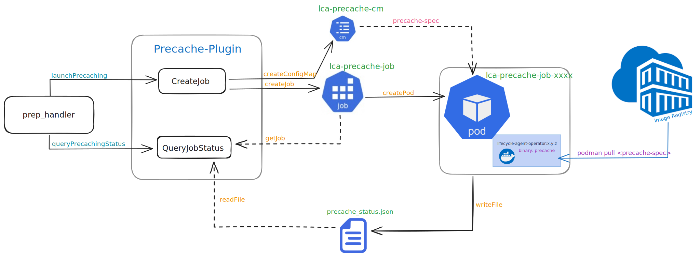

# Overview of the Precache Plugin

The  precache plugin provides functionality for pre-caching images locally on a Single Node OpenShift (SNO) cluster as
part of the lifecycle-agent operator (LCA) for image-based upgrades (IBU).
The primary purpose is to ensure that required container images are pre-pulled and available locally to streamline the
upgrade process. The plugin utilizes a Kubernetes Job and ConfigMap resource for orchestrating the pre-caching process.

## High-Level Design

The schematic below illustrates the high-level design of the precache plugin, exclusively utilized by the `prep_handler`
controller. The primary APIs, namely `CreateJob` and `QueryJobStatus`, play pivotal roles in the creation and status
querying of the pre-caching Kubernetes job. Additionally, there exists a third API, `Cleanup` (not depicted in the
schematic), responsible for resource cleanup.



The `CreateJob` function initiates the creation of a ConfigMap (`lca-precache-cm`) and a Kubernetes Job (`lca-precache-job`).
The ConfigMap holds the `precache-spec` data, containing the list of images earmarked for pre-caching. This ConfigMap is
then consumed by the precaching job. The job, in turn, spawns a pod equipped with the `lifecycle-agent-operator:x.y.z` image.
Executing with the pre-compiled `precache` binary, the job incorporates both `nice` and `ionice` options.
The main workload pulling mechanism resides in the [pullImages.go](../internal/precache/workload/pullImages.go) source file.
Configuration of the pre-caching job is achieved through the [Config](../internal/precache/precache.go) struct, outlined
below. A [progress](../internal/precache/progress.go) object is used to track the precaching job's progress, capturing
details such as the total number of images to be precached, the number of images pulled, and the number failed to be pulled,
along with a list of failed pulls. The results are persisted to the file `precache_status.json`.

The `QueryJobStatus` function is responsible for querying the status of the precaching job and attempting to load the
precaching status file, `precache_status.json`.

### 1. Configuration Options

The `Config` struct defines the configuration options for a pre-caching job. These options include:

- `ImageList`: A list of container images to be pre-cached.
- `NumConcurrentPulls`: Number of concurrent pulls for pre-caching.
- `NicePriority`: Nice priority for pre-caching, affecting process scheduling.
- `IoNiceClass`: I/O scheduling class for pre-caching (0: none, 1: realtime, 2: best-effort, 3: idle).
- `IoNicePriority`: I/O nice priority for pre-caching.
- `EnvVars`: A list of container spec environment variables to be set in the job definition.

### 2. ConfigMap Generation

The `CreateJob` function begins by validating the precaching job configuration and proceeds to generate a ConfigMap
containing the list of images to be pre-cached.

### 3. Kubernetes Job Creation

After the ConfigMap is created, the function proceeds to generate a Kubernetes Job based on the provided configuration.
This Job utilizes a workload image, and its primary responsibility is to execute the pre-caching process using the `podman`
CLI.

### 4. Job Execution and Monitoring

The Job is created within the Kubernetes cluster, initiating the pre-caching process. The status of the job is monitored,
and relevant information is logged, including whether the job is active, succeeded, or failed. Additionally, a progress
summary is extracted from a specified status file (`precache_status.json`), providing details on the total pulled
and failed images.

### 5. Job Cleanup

The `Cleanup` function is responsible for deleting the resources created during the pre-caching process. This includes
deleting the Kubernetes Job, ConfigMap, and the progress tracker file.

## Example Usage of Configuration

To instantiate a new `Config` instance, the `NewConfig` function is provided. It allows customization of configuration
parameters by passing key-value pairs as arguments. For example:

```go
config := NewConfig(imageList, "NumConcurrentPulls", 10, "NicePriority", 5)
```

This creates a configuration with the specified `imageList`, 10 concurrent pulls, and a nice priority of 5.

The following [default values](../internal/precache/constants.go) are assigned to unspecified config arguments:

```go
// Default precaching config values
NumConcurrentPulls  = 10
NicePriority        = 0
IoNiceClass         = 2 // best effort
IoNicePriority      = 4
```
